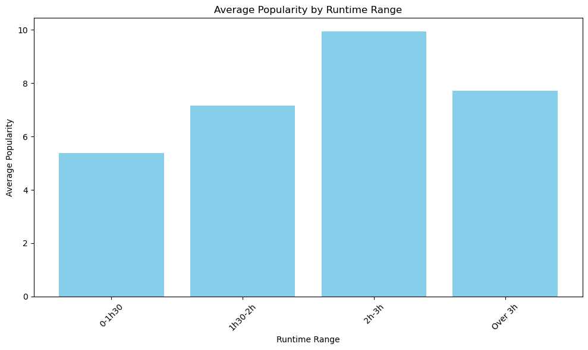
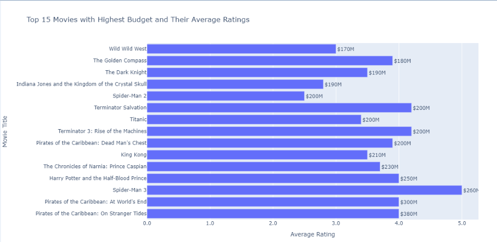

# Movies, their review and success factors 🎥

## Table of Contents

- [Introduction](#Introduction)
- [Hypotheses and their Visualisation](#Hypotheses-and-their-Visualisation)
- [Data Source](#Data-Source)
- [Kaban and Presentation](#Kaban-and-Presentation)
- [Credits](#Credits)

## Introduction

- This project explores the relationship between various movie attributes and their outcomes in terms of revenue, popularity, and user ratings. By leveraging a comprehensive movie dataset, we aim to uncover valuable insights that can inform future movie production and marketing strategies.

## Problem Statement

- How can various factors affect the success and the review of movies ?

## Hypotheses and their Visualisation

- **Optimal Movie Runtime and Success Metrics**
    - Check if there is an optimal movie runtime that correlates with higher popularity and revenue
    

    

    
    

    *Small insight about the running time (in minutes) of the films in the database (min, max and avg)*

- **Revenue Difference Between Action and War Genres**
    - Since those 2 filmes genres have sometimes similar stories they might have the same revenue or similar

    

- **Impact of Budget on User Ratings**
    - Movies with higher budgets tend to receive higher average ratings from users.

    

## Data Source

- [Kaggle Movies Dataset](https://www.kaggle.com/datasets/rounakbanik/the-movies-dataset?select=movies_metadata.csv)

## Kaban and Presentation
- [Notion Project Management](https://fluttering-gram-d49.notion.site/Movies-their-review-and-success-factors-69ba2203501640df9c1a0acdc488532e)
- [Google Slides Presentation](https://docs.google.com/presentation/d/1FNzaZJlkFQhhrS-Q9_-CmzFl6nx28HKSRAa4uZLQZew/edit#slide=id.g2ecf5877061_0_80)

## Credits

- [José Pedro Brandão Linkedin](https://www.linkedin.com/in/jos%C3%A9-pedro-barbosa-brand%C3%A3o-663a172b6/)
- [Mahshid Khatami]