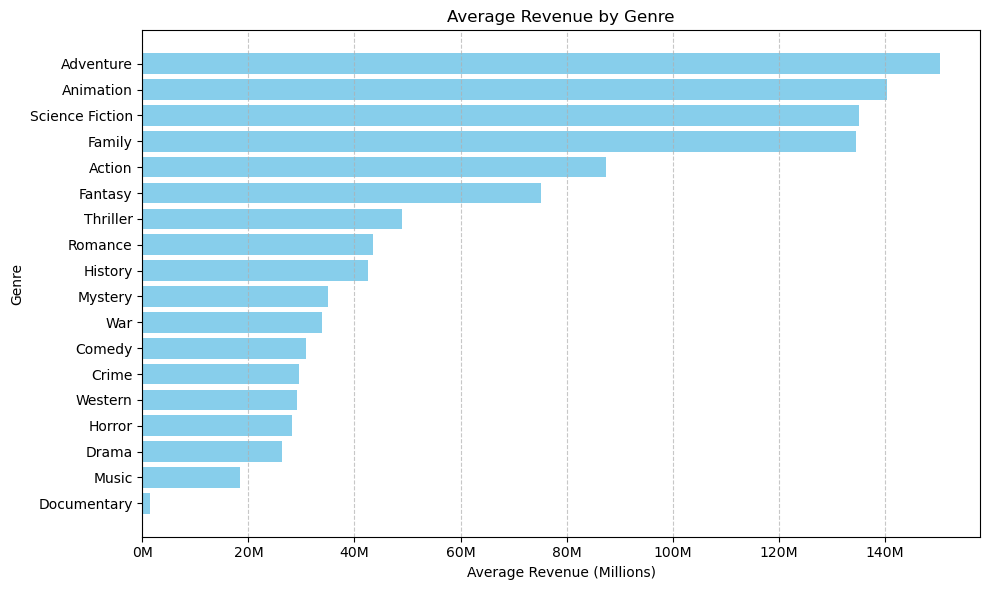

# Movies, their review and success factors 🎥

## Table of Contents

- [Introduction](#Introduction)
- [Hypotheses and their Visualisation](#Hypotheses-and-their-Visualisation)
- [Data Source](#Data-Source)
- [Kaban and Presentation](#Kaban-and-Presentation)
- [Credits](#Credits)

## Introduction

- This project explores the relationship between various movie attributes and their outcomes in terms of revenue, popularity, and user ratings. By leveraging a comprehensive movie dataset, we aim to uncover valuable insights that can inform future movie production and marketing strategies.

## Hypotheses and their Visualisation

- **Optimal Movie Runtime and Success Metrics**
    - Check if there is an optimal movie runtime that correlates with higher popularity and revenue
    

    

    
    

    *Small insight about the running time (in minutes) of the films in the database (min, max and avg)*

- **Revenue Difference Between Action and War Genres**
    - Since those 2 filmes genres have sometimes similar stories they might have the same revenue or similar

    

- **Impact of Budget on User Ratings**
    - Movies with higher budgets tend to receive higher average ratings from users.

    

## Data Source

- [Kaggle Movies Dataset](https://www.kaggle.com/datasets/rounakbanik/the-movies-dataset?select=movies_metadata.csv)

## Kaban and Presentation
- [Notion Project Management]()
- [Google Slides Presentation]()

## Credits

- [José Pedro Brandão Linkedin](https://www.linkedin.com/in/jos%C3%A9-pedro-barbosa-brand%C3%A3o-663a172b6/)